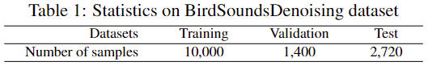
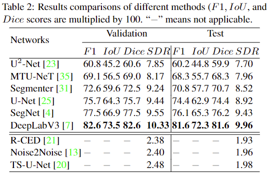

# BirdSoundsDenoising: Deep Visual Audio Denoising for Bird Sounds

This directory contains BirdSoundsDenoising dataset and the code for paper [BirdSoundsDenoising: Deep Visual Audio Denoising for Bird Sounds](https://github.com/YoushanZhang/YoushanZhang.github.io/blob/master/files/BirdSoundsDenoising_Deep_Visual_Audio_Denoising_for_Bird_Sounds.pdf), which is accepted by In 2023 IEEE Winter Applications of Computer Vision(WACV).

If you have any questions, please email to youshan.zhang@yu.edu.
### Reference

If you find it is helpful, please cite it as:

`
Zhang, Youshan, and Li, Jialu. (2023). BirdSoundsDenoising: Deep Visual Audio Denoising for Bird Sounds. In 2023 IEEE Winter Applications of Computer Vision (WACV).
`

### Datasets
The BirdSoundsDenoising dataset is available at [this link](https://doi.org/10.5281/zenodo.7191406).

In training and valid folders, the data structure is:

-------------Training/Valid

------------------Denoised_audios

------------------Images

------------------Masks

------------------Raw_audios

Raw_audios contain all noise bird sounds. Images are converted STFT noise bird sound images, and Masks are the labled clean sound areas. Denoised_audios are the denoised bird sound audios.

   

### Results

   

### Codes

audio2image.m: Matlab function of converting an audio to an image

image2audio.m: Matlab function of converting a denoised image to a denoised audio 

Audio2Image_Image2Audio_example.m: An example to show audio2image and image2audio functions.

